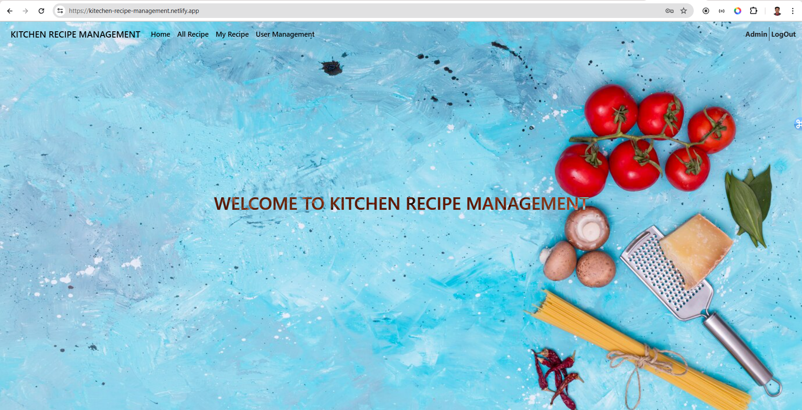
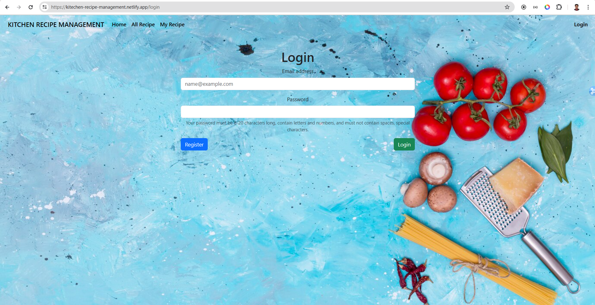
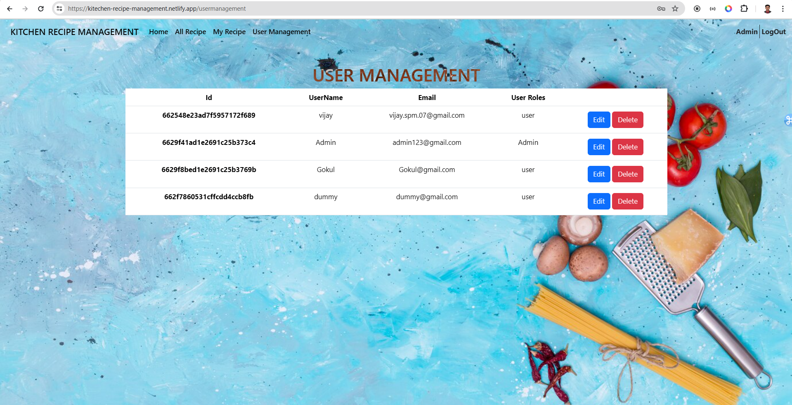

# KITCHEN RECIPE MANAGEMENT

- ### A user can add their recipe and it can be edited and deleted by a user.
- ### Admin can add Recipe and view of other recipe added by the user and can be edit or delete the recipe.
- ### Admin are able to modify user role or delete user.
- ### Visitors can view recipe as a guest and able to add Recipe but unable to add recipe once it is added.
- ### Other user cannot edit or delete the recipe except the Admin

## Features

- Login User
- Register User
- Edit User
- Add Recipe
- Edit Recipe
- View Recipe
- Delete Recipe

## 🔗 Links
[![Deployed URL]](https://kitechen-recipe-management.netlify.app/)

## Screenshots

